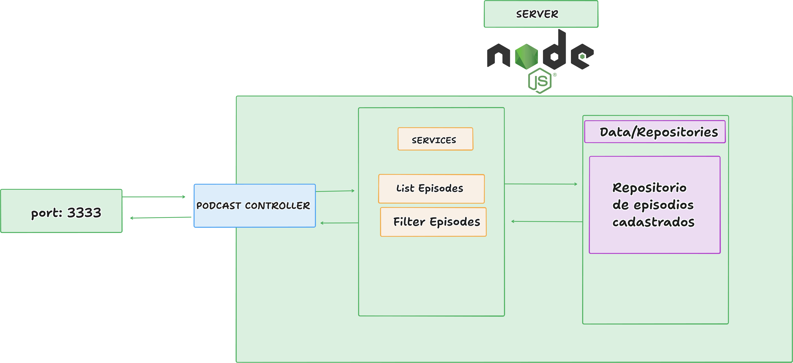

# Podcast Manager

### Descrição
Um app estilo netflix, onde possa centralizar diferentes episódios de podcast separados por categorias.

### Domínio
Podecasts feitos em videos (youtube)

### Features
- Listar os pods em sessões de de categorias
  - [saúde, fitness, filosofia, humor, esporte]
- Filtrar epsódios por nome do Podcast

## Como
### Feature
 Listae os eps em sessoes de categorias
### Como vou implementar:
  GET: Retorna lista de epsódios baseado em um paremetro enviado pelo cliente do nome do podcast

```js
  [ 
    {
      podcastName: "Epifania",
      episode: "TODA HISTÓRIA DA FILOSOFIA - Parte 1",
      videoId: "Y9_UovLgduo",
      cover: "https://i.ytimg.com/vi/Y9_UovLgduo/maxresdefault.jpg",
      link: "https://www.youtube.com/watch?v=Y9_UovLgduo&t=4247s",
      category: ["filosofia", "humor"]
    },
    {
      podcastName: "Epifania",
      episode: "TODA HISTÓRIA DA FILOSOFIA - Parte 2",
      videoId: "WEe6L5HVMwk",
      cover: "https://i.ytimg.com/vi/WEe6L5HVMwk/hq720.jpg",
      link: "https://www.youtube.com/watch?v=Y9_UovLgduo&t=4247s",
      category: ["filosofia", "humor"]
    },
    {
      podcastName: "Piradigmas",
      episode: "Por que você repete padrões tóxicos",
      videoId: "GW0ACNknpnA",
      cover: "https://i.ytimg.com/vi/GW0ACNknpnA/hq720.jpg",
      link: "https://www.youtube.com/watch?v=GW0ACNknpnA=4247s",
      category: ["filosofia", "humor"]
    },
    
  ]
```

